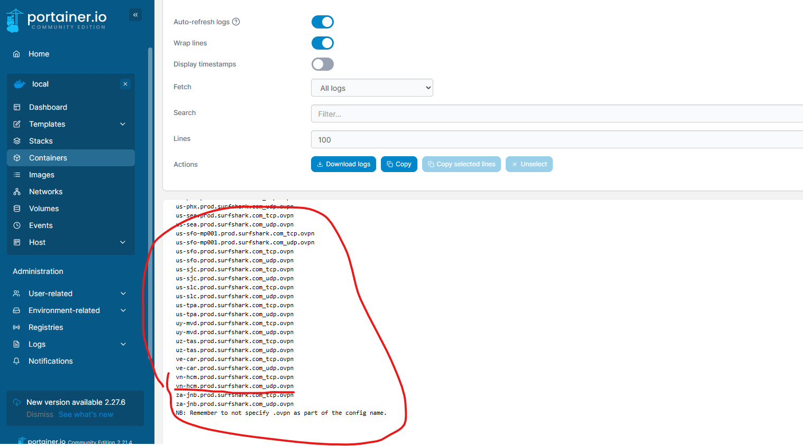
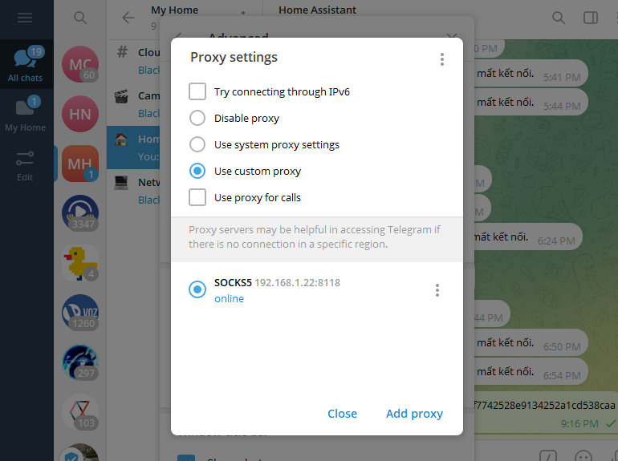

# 🧅 SOCKS5 Proxy qua VPN với Dante + Transmission-OpenVPN

Thiết lập SOCKS5 proxy chạy ẩn danh qua VPN bằng Docker, thích hợp để sử dụng trong Telegram hoặc các app hỗ trợ SOCKS5.

---

## 📥 Bắt đầu

### 1. Tải file cấu hình `sockd.conf`
Tải file `sockd.conf` và đặt vào thư mục lưu trữ Docker của bạn.

---

### 2. Tạo Stack (nếu dùng Portainer)

Tạo một Stack mới và dán nội dung từ file `docker-compose.yaml` vào.

---

### 3. Chỉnh sửa cấu hình VPN

Mở phần cấu hình `environment:` trong `docker-compose.yaml`, cập nhật các dòng sau:

#### ✅ `OPENVPN_PROVIDER`
Thay `SURFSHARK` bằng nhà cung cấp OpenVPN của bạn.

> 🔗 Xem danh sách provider hỗ trợ và tên viết tắt tại:  
> [https://haugene.github.io/docker-transmission-openvpn/supported-providers/](https://haugene.github.io/docker-transmission-openvpn/supported-providers/)

#### ✅ `OPENVPN_CONFIG`
Nếu bạn không biết URL cấu hình, cứ để mặc định.  
Khi container chạy, nó sẽ hiển thị toàn bộ danh sách config URL trong logs.  
➡️ **Xem ví dụ:** 

**Sao chép URL phù hợp từ logs và thay vào dòng `OPENVPN_CONFIG`.**

---

### 4. Tạo User và Password cho Proxy

Trong phần `command:` của container `socks5-proxy`, chỉnh dòng sau:

```sh
adduser -D -H -s /sbin/nologin blackden
echo "blackden:Abcd1234" | chpasswd
```

➡️ **Thay `blackden` bằng tên người dùng** bạn muốn.  
➡️ **Thay `Abcd1234` bằng mật khẩu mạnh** (khó đoán, không phổ biến) để tránh bị scan tấn công.

---

### 5. Cấu hình Telegram hoặc App hỗ trợ Proxy

- Mở Telegram (hoặc app SOCKS5 khác)
- Thêm Proxy:
  - **IP:** IP máy chủ Docker
  - **Port:** Port bạn cấu hình (mặc định là `8118`)
  - **Loại proxy:** SOCKS5
  - **User/Pass:** Thông tin bạn đã tạo ở bước 4

> ✅ Nếu muốn sử dụng từ xa, **hãy mở port 8118** trong firewall/router.

---

## 🖼️ Demo

| Logs hiển thị VPN configs | Telegram Proxy Settings | User Pass Openvpn |
|---------------------------|--------------------------|---------------------|
|                 |                |           |

---

## 🛡️ Lưu ý bảo mật

- Chọn mật khẩu mạnh (gợi ý: ít nhất 12 ký tự, gồm chữ hoa/thường, số và ký hiệu)
- Không dùng proxy với mật khẩu yếu hoặc để trống
- Giới hạn IP truy cập nếu cần (cấu hình trong `sockd.conf`)

---

## 🧠 Gợi ý nâng cao

- Sử dụng Docker secrets cho thông tin nhạy cảm
- Giám sát logs để phát hiện truy cập lạ
- Dùng proxy kết hợp với reverse proxy (Nginx) nếu cần cân bằng tải hoặc domain-based routing

---

💬 **Chúc bạn sử dụng an toàn và hiệu quả!**
